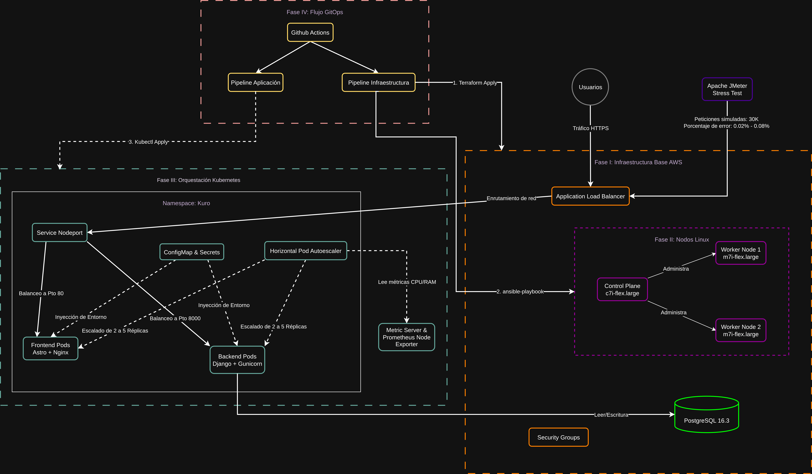

# Kuro Custom E-commerce (Monorepo)

## Resumen

Este repositorio contiene un e-commerce de referencia para personalización de productos, implementado como un monorepo con un backend en Django (API REST) y un frontend en Astro.

El objetivo del proyecto es servir como base reproducible para despliegue y operación en entornos locales (Docker Compose) y para infraestructura como código (Terraform), con archivos de automatización (Ansible) y manifiestos de Kubernetes como plantillas.

## Estructura del repositorio

- `kuro-backend/`: Backend Django (API REST, autenticación, pagos, envíos).
- `kuro-frontend/`: Frontend Astro (UI, flujo de checkout, consumo de API).
- `docker-compose.yml`: Orquestación local (PostgreSQL + backend + frontend).
- `terraform/`: Infraestructura como código (IaC). Nota: no se versionan `*.tfstate`.
- `ansible/`: Automatización de configuración (plantillas/playbooks).
- `k8s-manifests/`: Manifiestos de Kubernetes (plantillas).

## Arquitectura (alto nivel)



- **Frontend (Astro)**
  - Renderizado y UI del catálogo, cuenta y checkout.
  - Consumo de API REST del backend.
  - Variables públicas para ejecución en cliente con prefijo `PUBLIC_`.
- **Backend (Django + DRF)**
  - API REST para productos, usuarios, direcciones, órdenes y pagos.
  - Integraciones por variables de entorno (ej.: Stripe, Mercado Pago, Cloudinary, Skydropx).
- **Base de datos (PostgreSQL)**
  - Persistencia para usuarios, órdenes, productos y estados de pago/envío.

## Tecnologías

- Backend: Python, Django, Django REST Framework, PostgreSQL.
- Frontend: Astro, React (componentes), Axios.
- Infra/DevOps: Docker Compose, Terraform, (plantillas) Kubernetes y Ansible.

## Requisitos

- Para ejecución con Docker:
  - Docker y Docker Compose.
- Para desarrollo local sin Docker:
  - Backend: Python 3.x, virtualenv.
  - Frontend: Node.js 18+ (recomendado) y npm.

## Configuración de variables de entorno

Este repositorio **no** versiona archivos `.env` reales. Se incluyen archivos de ejemplo:

- Root: `.env.example` (variables para `docker-compose.yml`).
- Backend: `kuro-backend/.env.example`.
- Frontend: `kuro-frontend/.env.example`.

### Backend (Django)

Copiar el ejemplo y completar valores:

```bash
cp kuro-backend/.env.example kuro-backend/.env
```

Variables relevantes (resumen):

- `SECRET_KEY`: obligatoria.
- `DEBUG`: `True`/`False`.
- Base de datos: `DB_NAME`, `DB_USER`, `DB_PASSWORD`, `DB_HOST`, `DB_PORT`.
- Integraciones: `STRIPE_*`, `MERCADOPAGO_*`, `CLOUDINARY_*`, `SKYDROPX_*`, `GOOGLE_CLIENT_*`.

### Frontend (Astro)

Copiar el ejemplo y completar valores públicos:

```bash
cp kuro-frontend/.env.example kuro-frontend/.env
```

Variables públicas esperadas por el frontend:

- `PUBLIC_API_URL`.
- `PUBLIC_GOOGLE_CLIENT_ID`.
- `PUBLIC_STRIPE_PUBLISHABLE_KEY`.

Nota: las variables con prefijo `PUBLIC_` se exponen al navegador; no colocar secretos.

### Docker Compose (root)

Copiar el ejemplo y ajustar si aplica:

```bash
cp .env.example .env
```

## Ejecución local con Docker Compose

1. Configurar `.env` (root) y `.env` del backend/frontend según aplique.
2. Levantar servicios:

```bash
docker compose up --build
```

Servicios típicos:

- Frontend: http://localhost/
- Backend: http://localhost:8000/
- Base de datos (host): `localhost:5433`

## Desarrollo local sin Docker (opcional)

### Backend

1. Crear entorno e instalar dependencias:

```bash
cd kuro-backend
python -m venv .venv
source .venv/bin/activate
pip install -r requirements.txt
```

2. Definir variables de entorno con `kuro-backend/.env`.
3. Ejecutar migraciones y correr servidor:

```bash
python manage.py migrate
python manage.py runserver
```

### Frontend

1. Instalar dependencias y correr modo desarrollo:

```bash
cd kuro-frontend
npm install
npm run dev
```

## Infraestructura como código (Terraform)

La carpeta `terraform/` contiene archivos para IaC.

Importante:

- No se versiona `terraform.tfstate`, `terraform.tfstate.backup` ni `.terraform/`.
- Los valores sensibles deben administrarse por variables de entorno, secret managers o archivos `*.tfvars` no versionados.

## Seguridad y buenas prácticas de versionado

- Archivos `.env` reales y llaves privadas no deben subirse a Git.
- El `.gitignore` del repo ignora por defecto estados de Terraform, dependencias, cachés y artefactos de build.
- Antes de publicar, revisar que no existan credenciales en el historial ni en archivos fuera de `.env.example`.

## Licencia

Este repositorio no incluye un archivo de licencia (`LICENSE`).

## Citación (APA)

Nicanor y Garcia, D. C. (2026). _Kuro Custom E-commerce (Monorepo)_ [Software]. GitHub. https://github.com/daviduwu-png/kuro-custom-ecommerce
