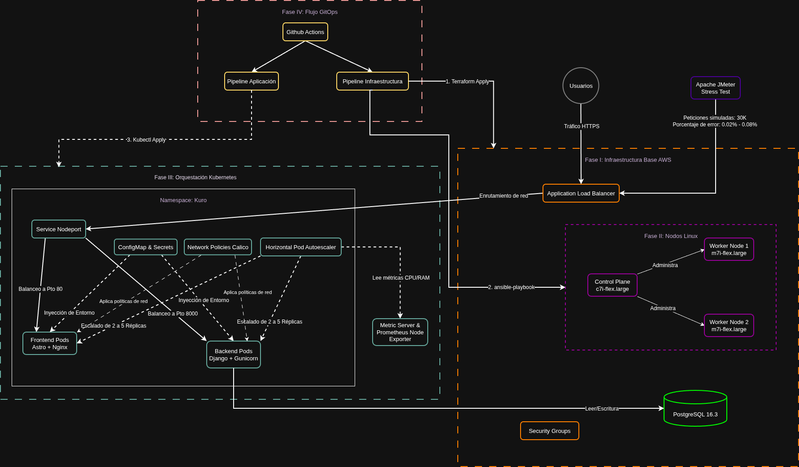

# Kuro Custom E-commerce (Monorepo)

## Resumen

Este repositorio contiene el código fuente y la infraestructura de **Kuro Custom E-commerce**, una aplicación de comercio electrónico (backend Django, frontend Astro/React, base de datos PostgreSQL 16.3) desarrollada como entorno de validación práctico para un trabajo de tesis sobre infraestructura cloud basada en Linux.

### Contexto de la Tesis

El proyecto se desarrolló principalmente sobre **Amazon Web Services (AWS)**, con una evaluación complementaria sobre **Google Cloud Platform (GCP)**. Tras comparar múltiples distribuciones Linux de nivel empresarial se seleccionó **Ubuntu Server 24.04 LTS** para los nodos de producción, junto con contenedorización mediante Docker y orquestación con Kubernetes (runtime: containerd).

La gestión de configuración siguió la metodología *Twelve-Factor Apps*, inyectando credenciales y parámetros mediante ConfigMaps y Secrets de Kubernetes, sin almacenarlos en el repositorio. El análisis se centró en identificar la combinación más eficiente en términos de latencia, tolerancia a fallos, seguridad perimetral (DevSecOps) y coste operativo, aplicando metodologías **FinOps** y principios de *Green Cloud Computing*.

### Resultados y Validación (Ingeniería del Caos)

La resiliencia fue validada bajo condiciones de carga extrema (saturación de CPU de hasta **398%**) mediante protocolos de Ingeniería del Caos con 30,000 peticiones HTTP concurrentes:

| Métrica | Resultado |
|---|---|
| Tasa de error | **0.04%** |
| Tiempo de respuesta promedio | **730 ms** |
| Escalado HPA | 2 → 5 réplicas sin downtime |
| MTTR ante caída de nodo | Horas → **minutos** (multi-AZ) |

---

## Decisiones Arquitectónicas y Justificación Técnica

Esta sección documenta las decisiones de diseño no triviales, sus razones y sus compromisos conscientes. Está orientada a lectores que revisen el código en el contexto de la tesis.

### 1. Kubernetes self-managed (kubeadm) en lugar de EKS

Se eligió **kubeadm sobre EC2** en lugar de Amazon EKS por dos razones:

1. **Restricción de costo:** EKS cobra $0.10/hora (~$73/mes) solo por el control plane, independientemente de los nodos. Esto lo excluye del AWS Free Tier.
2. **Profundidad académica:** Correr K8s bare-metal expone el control plane completo (etcd, kube-apiserver, scheduler) para observabilidad directa con Prometheus, lo que un servicio gestionado abstrae. Para los objetivos de la tesis, esta visibilidad era necesaria.

**Compromiso:** Sin EKS no hay Cluster Autoscaler nativo. El HPA escala pods (de 2 a 5 réplicas) pero los nodos son fijos. Ante una demanda que supere la capacidad de los 2 workers, los pods nuevos quedan en estado `Pending`. Esto se documenta como limitación del entorno de investigación.

**Patrón ideal sin restricción de costo:** EKS + Managed Node Groups + Cluster Autoscaler (escalado de nodos) + HPA (escalado de pods).

### 2. EC2 de tamaño fijo como decisión metodológica (no antipatrón por ignorancia)

Los 3 nodos EC2 (`c7i-flex.large` control plane, 2× `m7i-flex.large` workers) se aprovisionaron con capacidad fija por diseño experimental: las pruebas de carga deben ejecutarse en un entorno de hardware controlado y reproducible. Si los nodos escalaran automáticamente durante la prueba, las métricas obtenidas no serían comparables entre ejecuciones.

> Esto contrasta deliberadamente con el antipatrón de *static sizing* que describe el AWS Well-Architected Framework (tratar la nube como un collocated data center). En producción sin restricciones, el patrón correcto sería Auto Scaling Groups con Target Tracking o EKS con Karpenter.

### 3. ALB Multi-AZ como componente elástico nativo

El **Application Load Balancer** (subnets en `us-east-1a` y `us-east-1b`) es elástico por diseño de AWS: escala internamente sin intervención del operador. Se eligió ALB sobre Classic Load Balancer por soporte de path-based routing (`/api/*` → backend, `/` → frontend) y terminación TLS con ACM.

### 3.5 Calico como CNI — segmentación de red interna con Network Policies

Se eligió **Calico** como Container Network Interface (CNI) en lugar de Flannel por una razón funcional directamente alineada al tema de la tesis (*diseño e implementación de infraestructura cloud basada en Linux para aplicaciones web escalables*): la capacidad de aplicar **Network Policies** nativas de Kubernetes.

**Flannel** ofrece únicamente conectividad L3 entre pods (overlay VXLAN), sin ningún mecanismo de segmentación. En un namespace sin Network Policies, cualquier pod puede conectarse a cualquier otro pod del cluster en cualquier puerto — incluyendo conexiones desde el frontend directamente al pod del backend omitiendo el Service, o desde un pod comprometido hacia el endpoint de RDS.

**Calico** implementa el mismo overlay de red pero además actúa como controlador de Network Policies, programando reglas `iptables`/`eBPF` en cada nodo para hacer cumplir las políticas declaradas en los manifiestos de Kubernetes.

**Modelo de segmentación implementado** (`k8s-manifests/07-network-policies.yaml`):

```
Principio: default-deny-ingress + allowlist explícita por servicio

Internet → ALB → NodePort → [frontend] ──(8000)──→ [backend] → RDS :5432
                                ↑                      ↑
                         allow desde nodo        allow desde frontend
                         (filtrado por SG AWS)   y desde ALB via NodePort

Flujos denegados implícitamente:
  ✗ frontend → RDS directamente (5432)
  ✗ backend  → frontend (el backend no inicia conexiones hacia el frontend)
  ✗ monitoring namespace → pods de kuro sin autorización explícita
```

**Nota sobre el CIDR:** Flannel usa `10.244.0.0/16` por defecto; Calico usa `192.168.0.0/16`. El pod CIDR está centralizado en `group_vars/all.yml` y se pasa a `kubeadm` via `podSubnet`, garantizando consistencia entre el plano de control y el CNI.

### 4. RDS en subnets públicas con `publicly_accessible = false`

La práctica del AWS Well-Architected Framework exige que la capa de datos resida en **subnets privadas** sin ruta al Internet Gateway. Esta arquitectura usa las mismas subnets públicas para RDS por restricción de costo: un **NAT Gateway** tiene un costo fijo de ~$45/mes que excede el presupuesto del Free Tier.

**Controles compensatorios aplicados:**
- `publicly_accessible = false` en RDS — AWS no asigna IP pública al endpoint.
- Security Group restringido — solo los nodos K8s tienen acceso al puerto 5432.
- Cifrado en tránsito habilitado por defecto en PostgreSQL 16.

**Deuda técnica documentada:** En un entorno de producción real, RDS debe estar en subnets privadas con acceso únicamente desde los nodos de la capa de aplicación.

### 5. HPA con Target Tracking — elasticidad real dentro de los nodos

El **Horizontal Pod Autoscaler** (`06-hpa.yaml`) implementa el patrón de *Target Tracking Scaling* descrito en el pilar de Eficiencia de Rendimiento del Well-Architected Framework:

```
CPU promedio > 50% → K8s escala de 2 a 5 réplicas automáticamente
CPU promedio < 50% → K8s reduce réplicas para liberar recursos
```

Este es el componente de elasticidad más significativo del proyecto. Opera de forma totalmente automática y fue validado durante las pruebas de Ingeniería del Caos.

### 6. CI/CD con IP dinámica y apertura temporal de Security Group

El pipeline de despliegue (`despliegue-app.yml`) resuelve la IP del control plane **dinámicamente por tags EC2** (no está hardcodeada) y abre el puerto SSH en el Security Group únicamente durante la ejecución del job, cerrándolo con `if: always()` incluso si el pipeline falla. Los secrets se inyectan en los manifiestos de K8s via `sed` en tiempo de ejecución — nunca se almacenan en el repositorio.

### 7. Stack de Observabilidad automatizado y seguro (Prometheus + Grafana)

El stack de monitoreo se despliega mediante Ansible (`ansible/playbooks/observability.yml`), que renderiza y aplica los manifiestos de K8s ubicados en `k8s-manifests/monitoring/`. Se usa el módulo `template` de Ansible para sustituir las versiones de imagen (definidas en `group_vars/all.yml`) antes de aplicarlos al cluster. 

Para garantizar la seguridad perimetral del panel de administración, **Grafana se encuentra detrás del Application Load Balancer (ALB)**, expuesto mediante un subdominio exclusivo (`grafana.kurocustom.uk`) con cifrado TLS/HTTPS. Adicionalmente, se previno la fuga de información (Information Disclosure) eliminando las contraseñas en texto plano de los manifiestos; ahora se inyectan dinámicamente mediante **Kubernetes Secrets** alimentados por GitHub Actions.

**Auto-Provisioning de Dashboards ("Infraestructura Inmutable")**
Con el objetivo de mantener un entorno verdaderamente reproducible (sin intervención manual de configuración post-despliegue), se implementó un mecanismo de *Provisioning* automático en Grafana mediante un **Init Container** y **ConfigMaps**. Al inicializarse, el pod de Grafana descarga dinámicamente desde la API oficial los dashboards necesarios para medir las pruebas de Ingeniería del Caos (JMeter):
- **Node Exporter (ID 1860):** Para el monitoreo de saturación física en los nodos EC2.
- **cAdvisor (ID 14282):** Para la medición granular de consumo (CPU/RAM) a nivel de pod/contenedor, consumido directamente desde el Kubelet.
*Prometheus queda configurado automáticamente como Data Source por defecto en el arranque.*

| Componente | Tipo K8s | Puerto NodePort | Función |
|---|---|---|---|
| Node Exporter | DaemonSet | — | Métricas del host: CPU, RAM, disco, red |
| Prometheus | Deployment | 30090 | Scraping y almacenamiento de series de tiempo |
| Grafana | Deployment | 30300 | Visualización de dashboards (Expuesto de forma segura vía ALB) |

> **Limitación conocida:** Los datos de Prometheus y Grafana se almacenan en `emptyDir` (volumen efímero). Si el pod se reinicia, el historial se pierde. En producción se requeriría un `PersistentVolume` (ej.: EBS). Para el entorno de investigación es suficiente ya que las capturas se tomaban durante las sesiones de prueba.

### 8. Gestión de DNS Automatizada (Terraform + Cloudflare)

Para resolver el reto del cambio dinámico de URLs e IPs al destruir y recrear la infraestructura en AWS, el proyecto integra el **proveedor de Cloudflare en Terraform** (`cloudflare.tf`). 

Durante el pipeline de despliegue (`despliegue-infra.yml`), Terraform se comunica automáticamente con la API de Cloudflare para:
1. Crear los registros DNS de validación de ACM, permitiendo a AWS emitir los certificados SSL sin intervención manual.
2. Actualizar los registros CNAME del dominio principal (`www` y `@`) y del stack de observabilidad (`grafana`) para que apunten al nuevo ALB recién aprovisionado.

### 9. Frontend en Kubernetes en lugar de S3 + CloudFront

Una arquitectura JAMstack alternativa habría consistido en servir el build estático de Astro/React desde un **S3 bucket con CloudFront** como CDN, desacoplando completamente la capa de presentación del clúster. Esta opción fue evaluada y descartada deliberadamente por las siguientes razones:

1. **Coherencia del objeto de investigación:** La tesis valida el comportamiento de Kubernetes bajo carga extrema. Si el frontend reside fuera del clúster, el tráfico de la UI queda fuera del plano de control de K8s, lo que significa que el HPA, las métricas de Prometheus y los dashboards de Grafana capturarían únicamente la carga del backend. Los resultados de las pruebas de Ingeniería del Caos (30.000 peticiones concurrentes) serían parciales e incomparables entre ejecuciones.

2. **Integridad del experimento:** El entorno de hardware debe ser controlado y reproducible. Introducir una CDN con caché distribuida haría que los tiempos de respuesta medidos dependieran de variables externas al clúster (hit/miss ratio de caché, edge locations de CloudFront), invalidando la metodología experimental.

3. **Simplicidad del plano de control:** Mantener todo el tráfico dentro de un único ALB con path-based routing (`/` → frontend, `/api/*` → backend) simplifica la topología de red y la trazabilidad de métricas. Añadir CloudFront implicaría un segundo punto de entrada con su propia capa de logs, complicando el análisis de causa raíz durante los escenarios de fallo.

**Patrón ideal sin restricción metodológica:** Para producción real, Astro genera un build 100 % estático apto para S3 + CloudFront, lo que reduciría drásticamente la carga sobre los workers de K8s y mejoraría el Time to First Byte (TTFB) globalmente mediante distribución en edge locations.

### 10. Ausencia de VPC Gateway Endpoints (S3 / DynamoDB)

Los **VPC Gateway Endpoints** permiten que el tráfico `EC2 → S3` o `EC2 → DynamoDB` se enrute de forma privada a través de la red troncal de AWS, sin atravesar el Internet Gateway. Esto elimina el costo de transferencia de datos de salida (*data transfer out*) y reduce la latencia en arquitecturas con flujo continuo de datos entre EC2 y S3.

En este proyecto, la ausencia de endpoints es una decisión consciente basada en el análisis del patrón de acceso real a S3:

| Caso de uso S3 | Frecuencia | Justificación |
|---|---|---|
| Remote state de Terraform (`kuro-custom-tfstate`) | Puntual (solo en CI/CD) | Operación de minutos por despliegue, no en el path crítico de la aplicación |
| Logs de acceso del ALB (`kuro-alb-logs`) | Escritura pasiva del propio ALB | El ALB escribe directamente; los EC2 no leen estos logs en runtime |
| Acceso desde pods K8s a S3 | Inexistente en runtime | Las imágenes de productos se gestionan mediante Cloudinary (servicio externo) |

Dado que ningún flujo de datos en el path crítico de la aplicación involucra tráfico EC2 → S3 de forma continua, el costo de transferencia de datos que un Gateway Endpoint mitigaría es despreciable en este entorno. Añadir el endpoint introduciría entradas adicionales en la Route Table y política de endpoint sin un beneficio medible.

**Cuándo sería necesario:** Si el backend Django descargara assets desde S3 en cada request (ej.: imágenes almacenadas en S3 en lugar de Cloudinary), o si RDS realizara exports continuos a S3, el volumen de tráfico justificaría el endpoint tanto por costo como por latencia.

---

## Estructura del repositorio

```
kuro-custom-ecommerce/
├── kuro-backend/          # Backend Django (API REST, autenticación, pagos, envíos)
├── kuro-frontend/         # Frontend Astro/React (UI, checkout, consumo de API)
├── terraform/             # IaC: VPC, EC2, RDS, ALB, ACM, S3
├── ansible/
│   ├── playbooks/         # Automatización por capas (hardening → K8s → observabilidad)
│   └── inventory/         # Inventario dinámico AWS EC2 + group_vars
├── k8s-manifests/
│   ├── 00-namespace.yaml      # Namespace kuro
│   ├── 01-configmap.yaml      # Variables de configuración no sensibles
│   ├── 02-secret.yaml         # Secrets inyectados por CI/CD (nunca en repo)
│   ├── 03-services.yaml       # NodePort services (frontend: 30080, backend: 30800)
│   ├── 04-backend-deployment.yaml  # Deployment Django con HPA, probes y securityContext
│   ├── 05-frontend-deployment.yaml # Deployment Astro/React
│   ├── 06-hpa.yaml            # HorizontalPodAutoscaler (CPU target tracking 50%)
│   ├── 07-network-policies.yaml    # Segmentación de red: deny-all + allowlist por servicio
│   └── monitoring/            # Manifiestos del stack de observabilidad (Prometheus, Grafana)
├── .github/
│   ├── workflows/         # Pipelines CI/CD (despliegue-app, despliegue-infra, seguridad)
│   └── dependabot.yml     # Actualizaciones automáticas de dependencias
└── docker-compose.yml     # Orquestación local para desarrollo
```

### Capas de despliegue (Ansible `site.yml`)

```
Capa 0 — hardening.yml       → OS hardening, swap off, sysctl para K8s
Capa 1 — install-tools.yml   → containerd, kubelet, kubeadm, kubectl
Capa 2 — init-kubernetes.yml → kubeadm init, join workers, Calico CNI, Metrics Server
Capa 3 — observability.yml   → Prometheus, Node Exporter, Grafana
```

## Arquitectura (alto nivel)



```
Internet
  └→ ALB (Multi-AZ: us-east-1a + us-east-1b) — HTTPS, path-based routing
        ├→ NodePort 30080 → kuro-frontend pods (Astro/React)
        └→ NodePort 30800 → kuro-backend pods (Django)
                                  ↕ HPA: 2–5 réplicas por CPU
              EC2 Worker 1 (us-east-1a)  +  EC2 Worker 2 (us-east-1b)
              EC2 Control Plane (us-east-1a) — kubeadm, etcd, kube-apiserver
                          └→ RDS PostgreSQL 16.3 (db.t3.micro)
```

## Tecnologías

| Capa | Tecnologías |
|---|---|
| **Aplicación** | Python, Django, DRF, Astro, React, PostgreSQL |
| **Contenedores** | Docker, containerd, Kubernetes (kubeadm), Calico CNI |
| **IaC** | Terraform ≥ 1.10, provider AWS ~6.0 |
| **Configuración** | Ansible, inventario dinámico EC2 (plugin `aws_ec2`) |
| **CI/CD** | GitHub Actions, Docker Hub |
| **DevSecOps** | Dependabot, Trivy, Tfsec, `runAsNonRoot`, Security Groups dinámicos |
| **Observabilidad** | Prometheus, Node Exporter, Grafana |
| **Cloud** | AWS (EC2, RDS, ALB, ACM, S3, VPC), GCP (evaluación comparativa) |

## Requisitos

- **Docker Compose (desarrollo local):** Docker y Docker Compose.
- **Desarrollo sin Docker:** Python 3.x + virtualenv (backend), Node.js 18+ (frontend).

## Configuración de variables de entorno

Este repositorio **no** versiona archivos `.env` reales. Se incluyen archivos de ejemplo:

- Root: `.env.example` (variables para `docker-compose.yml`)
- Backend: `kuro-backend/.env.example`
- Frontend: `kuro-frontend/.env.example`

### Backend (Django)

```bash
cp kuro-backend/.env.example kuro-backend/.env
```

Variables relevantes: `SECRET_KEY`, `DEBUG`, `DB_NAME/USER/PASSWORD/HOST/PORT`, `STRIPE_*`, `MERCADOPAGO_*`, `CLOUDINARY_*`, `SKYDROPX_*`, `GOOGLE_CLIENT_*`.

### Frontend (Astro)

```bash
cp kuro-frontend/.env.example kuro-frontend/.env
```

Variables públicas (`PUBLIC_` prefix, se exponen al navegador): `PUBLIC_API_URL`, `PUBLIC_GOOGLE_CLIENT_ID`, `PUBLIC_STRIPE_PUBLISHABLE_KEY`.

### Docker Compose (root)

```bash
cp .env.example .env
```

## Ejecución local con Docker Compose

```bash
docker compose up --build
```

- Frontend: http://localhost/
- Backend API: http://localhost:8000/
- PostgreSQL: `localhost:5433`

## Desarrollo local sin Docker

### Backend

```bash
cd kuro-backend
python -m venv .venv && source .venv/bin/activate
pip install -r requirements.txt
python manage.py migrate
python manage.py runserver
```

### Frontend

```bash
cd kuro-frontend
npm install
npm run dev
```

## Infraestructura como Código (Terraform)

El estado de Terraform se almacena remotamente en S3 (`kuro-custom-tfstate`) con cifrado y bloqueo mediante S3 native locking (`use_lockfile = true`, requiere Terraform ≥ 1.10). **No se versiona estado local** — `*.tfstate`, `*.tfstate.backup` y `.terraform/` están en `.gitignore`.

## Seguridad y buenas prácticas

- Archivos `.env` reales y llaves privadas no se suben a Git.
- Los secrets de producción se inyectan en tiempo de ejecución del pipeline (GitHub Secrets → `sed` → manifiestos K8s).
- Los pods corren con `runAsNonRoot: true` y `allowPrivilegeEscalation: false`.
- El puerto SSH (22) solo se abre temporalmente durante el deploy y se cierra con `if: always()`.

## Licencia

Este repositorio no incluye un archivo de licencia (`LICENSE`).

## Citación (APA)

Nicanor y Garcia, D. C. (2026). _Kuro Custom E-commerce (Monorepo)_ [Software]. GitHub. https://github.com/daviduwu-png/kuro-custom-ecommerce
